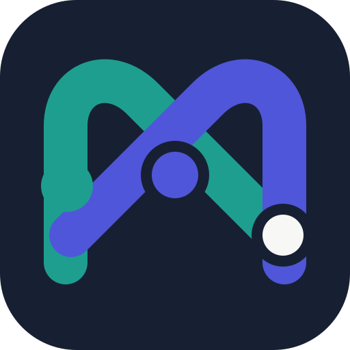
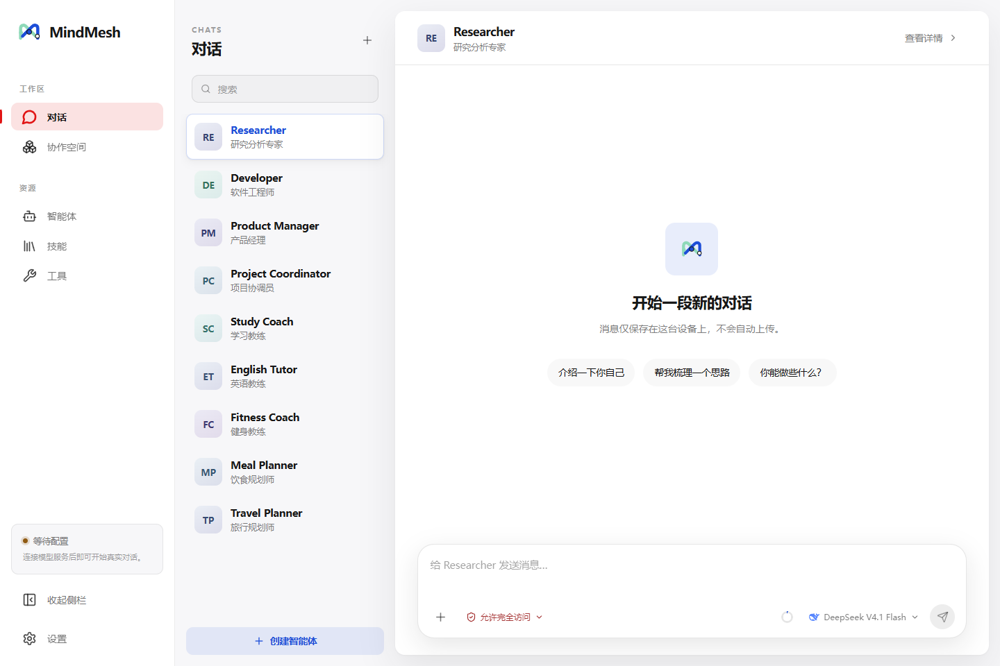
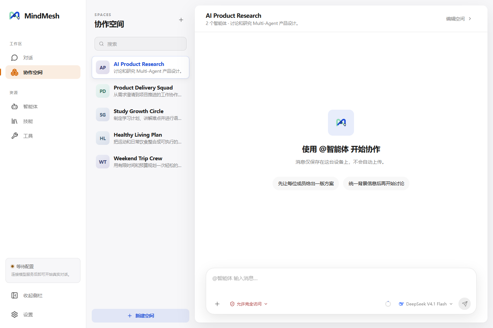
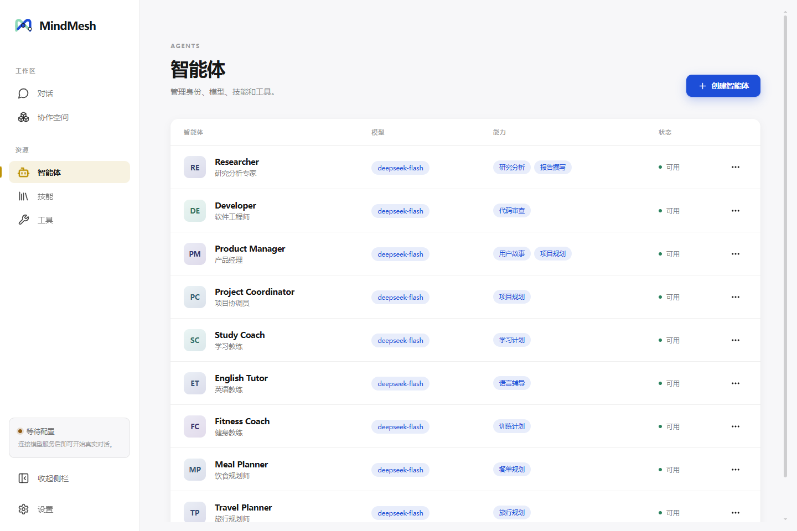
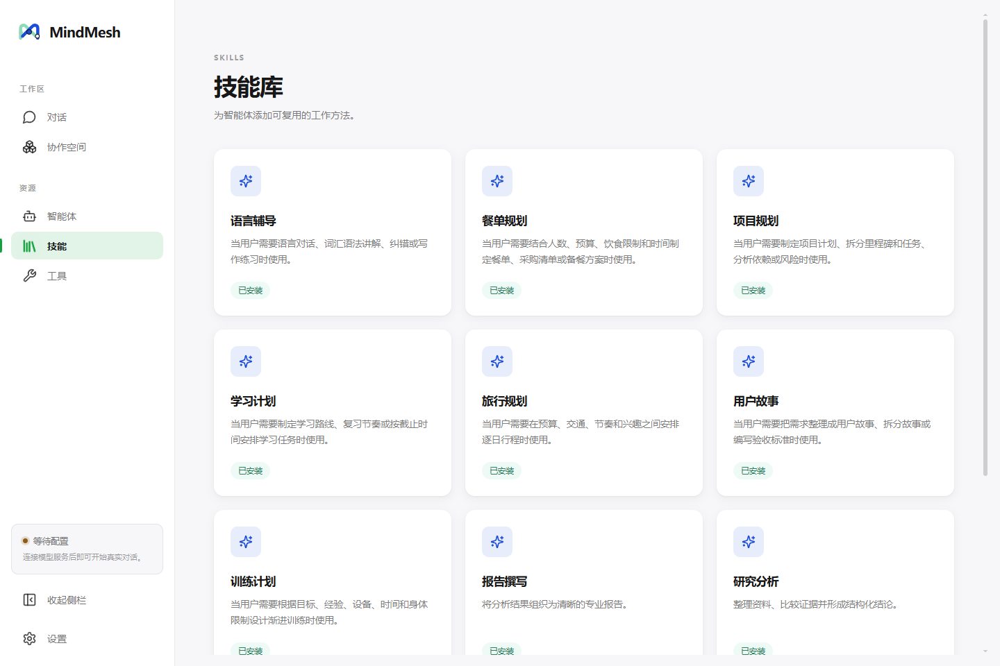
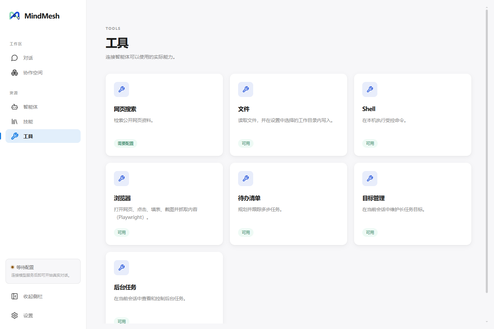
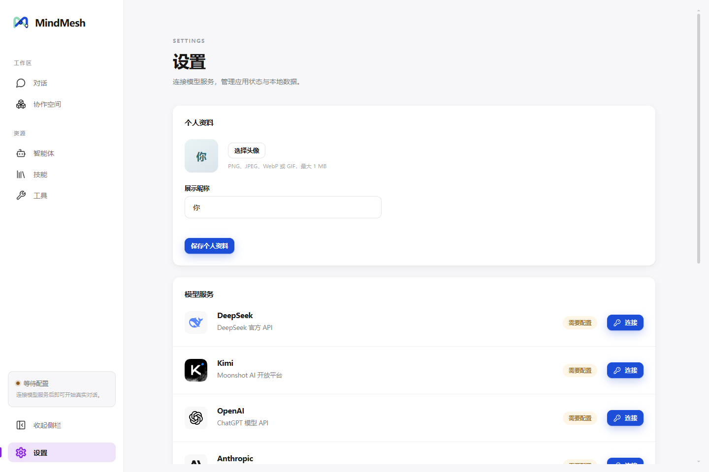
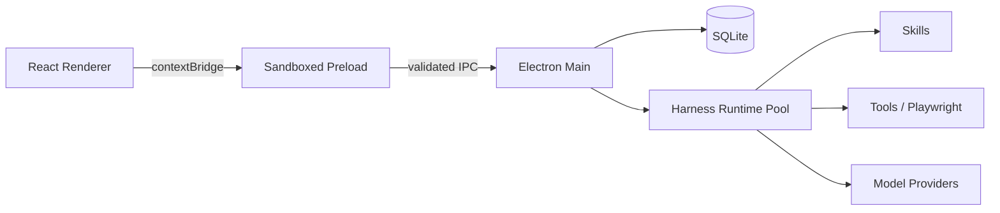

<p align="center">
  
</p>

<h1 align="center">MindMesh</h1>

<p align="center">
  本地优先的多智能体桌面工作台<br />
  组建各有所长的 AI 团队，在私聊或协作空间里完成研究、规划、写作与开发任务。
</p>



## MindMesh 是什么

MindMesh 是一款基于 Electron 的 Windows 桌面应用。你可以为每个智能体分别配置身份设定、模型、技能和工具，也可以把多个智能体放进同一个协作空间，通过 `@智能体` 指定参与者与执行顺序。

对话、智能体、空间和运行会话默认保存在本机；API Key 由 Electron `safeStorage` 调用操作系统能力加密保存。没有配置模型密钥时，应用会进入演示模式，仍可体验界面和管理流程。

## 核心能力

- **智能体编排**：独立设置角色、提示词、模型、技能与工具；修改名称和角色不会意外丢失既有会话。
- **私聊与协作空间**：保留每个智能体的独立上下文，也能让多个角色共享背景并按 `@` 提及顺序协作。
- **对话运行控制**：每轮可选择模型和权限级别，查看上下文用量，并随时停止正在生成的回复。
- **多模态输入**：DeepSeek Flash 对话支持 PNG、JPEG、WebP 与 GIF 图片附件。
- **技能与工具**：从本地 `SKILL.md` 发现技能；按需启用网页搜索、文件、Shell、浏览器、待办、目标和后台任务。
- **模型服务**：内置 DeepSeek、Kimi、OpenAI、Anthropic，并可接入兼容 OpenAI API 的自定义服务。
- **桌面体验**：三栏布局可拖动调宽、收起导航；支持 Markdown、折叠思考过程、搜索、个人昵称与头像。

## 界面预览

### 多智能体协作空间

一个 Space 可以组合多个角色，共享目标、背景和讨论历史，并通过 `@智能体` 控制发言顺序。



### 智能体管理

集中查看智能体的模型、角色技能和可用状态；点开后可继续对话或编辑能力配置。



### 技能库与工具

技能提供可复用的工作方法，工具负责连接网页、本地文件、Shell、浏览器和长任务状态。

<table>
  <tr>
    <td></td>
    <td></td>
  </tr>
  <tr>
    <td align="center">技能库</td>
    <td align="center">工具</td>
  </tr>
</table>

### 设置

管理个人资料、模型服务、DeepSeek 余额、Agent 工作目录和本地运行状态。



## 工作原理



模型服务、模型、身份设定、技能和工具共同形成能力快照与哈希。MindMesh 按能力和工作目录隔离 Harness Home 与运行会话；名称、角色等展示信息则实时覆盖，因此改名不会无故重置会话。

## 快速开始

### 环境要求

- Windows 10/11
- Node.js 24+
- Corepack

### 安装与启动

```powershell
git clone git@github.com:Even-wang666/MindMesh.git
cd MindMesh
corepack pnpm@11.7.0 install
corepack pnpm@11.7.0 dev
```

首次启动后，前往 **设置 → 模型服务** 连接服务。也可以先通过环境变量配置密钥：

```powershell
$env:DEEPSEEK_API_KEY = "你的 API Key"
corepack pnpm@11.7.0 dev
```

支持的环境变量还有 `MOONSHOT_API_KEY`、`OPENAI_API_KEY` 和 `ANTHROPIC_API_KEY`。DeepSeek 连接成功后，设置页会显示账户余额状态。

## 开发与验证

```powershell
# 类型检查、单元/组件测试、生产构建
corepack pnpm@11.7.0 typecheck
corepack pnpm@11.7.0 test
corepack pnpm@11.7.0 build

# 校验安全边界与打包依赖
corepack pnpm@11.7.0 smoke:security
corepack pnpm@11.7.0 check:package-deps
```

`smoke:electron` 会运行真实 Electron 与 Harness 冒烟流程，需要可用的 DeepSeek API Key：

```powershell
corepack pnpm@11.7.0 smoke:electron
```

重新生成本文档中的界面截图：

```powershell
node scripts/capture-readme-screenshots.mjs
```

截图脚本使用一次性的临时用户目录和演示模式，不会读取或展示本机已有的聊天记录与 API Key。

## 构建 Windows 应用

```powershell
# 免安装目录
corepack pnpm@11.7.0 package:dir

# NSIS 安装包
corepack pnpm@11.7.0 package:win
```

构建产物位于 `release/`。

## 项目结构

```text
src/
├─ main/       Electron 主进程、SQLite、模型服务与 Harness 运行池
├─ preload/    沙箱中的安全 IPC 桥
├─ renderer/   React 桌面界面
└─ shared/     共享类型、校验与领域逻辑
tests/         数据库、能力、运行池、界面、安全与对话流程测试
docs/          产品、设计、实施文档与界面截图
scripts/       构建检查、冒烟测试和截图脚本
```

## 本地数据与安全

- 产品数据保存在 Electron `userData/mindmesh-data`，不会写入源码目录。
- API Key 使用操作系统安全存储加密，不进入 SQLite、日志或 Git。
- Renderer 启用 CSP，Preload 在 Electron sandbox 中运行，只暴露受限且经过校验的 IPC 接口。
- Agent 的文件写入限制在设置中选择的工作目录；Shell 只有在智能体配置和当轮权限都允许时才会启用。
- 应用阻止非预期的窗口、导航和外部协议，并对日志中的敏感信息做脱敏处理。

## 当前状态

MindMesh 仍处于持续开发阶段，当前以 Windows 为主要目标平台。真实模型能力取决于所连接服务的可用性；部分 Harness 依赖仍为 alpha 版本。

项目使用 [MIT License](LICENSE)。第三方 Skill 的来源与许可见 [THIRD_PARTY_NOTICES.md](THIRD_PARTY_NOTICES.md)。
