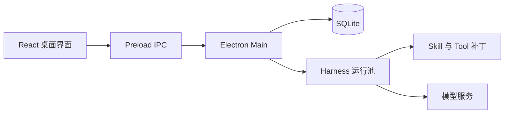

<p align="center">
  
</p>

<h1 align="center">MindMesh</h1>

<p align="center">
  本地优先的多智能体桌面协作平台<br />
  创建不同角色的 AI 智能体，让它们在私聊和协作空间中共同完成工作、学习与生活任务。
</p>

## 项目简介

MindMesh 是一个基于 Electron 的多智能体桌面应用。每个智能体都可以拥有独立的身份设定、模型、技能和工具；多个智能体可以加入同一个协作空间，共享背景信息并按 `@智能体` 顺序参与讨论。

项目目前已经覆盖从智能体创建、模型配置、实时对话到本地持久化的完整桌面工作流。所有聊天记录、角色配置和运行会话默认保存在本机，API Key 由 Electron `safeStorage` 使用操作系统能力加密。

## 可以用它做什么

- **产品与项目推进**：产品经理整理用户故事，项目协调员拆分里程碑、依赖和风险。
- **学习与语言练习**：学习教练制定复习计划，语言教练提供对话、语法和写作反馈。
- **健康生活规划**：健身教练安排渐进训练，饮食规划师生成餐单、采购清单和备餐顺序。
- **旅行规划**：旅行规划师结合日期、预算、交通和兴趣生成逐日行程。
- **研究与开发**：研究员整理资料和证据，开发者借助文件与 Shell 工具完成技术任务。

## 核心功能

- 创建和编辑智能体，分别配置身份、模型、技能与工具。
- 支持私聊和多智能体协作空间，提供 `@Agent` 自动补全与顺序执行。
- 回复以流式效果展示；思考过程分段显示，并在回答完成后保留为可折叠内容。
- 用户消息和智能体回复统一使用 Markdown 排版。
- 内置项目规划、用户故事、学习计划、语言辅导、训练计划、餐单规划和旅行规划等角色技能。
- 从本地 `SKILL.md` 发现技能，并按稳定 Skill ID 绑定到独立 Harness 运行环境。
- 支持网页搜索、工作目录文件读写和本地 Shell 工具。
- 支持 DeepSeek、Kimi、OpenAI、Anthropic 以及自定义兼容服务。
- 使用 SQLite 保存 Agent、Space、消息和运行会话；切换工作目录不会丢失聊天历史。

## 界面预览

### 私聊

为每个智能体保留独立对话与运行上下文。


### 多智能体协作空间

一个 Space 可以组合多个角色，共享目标、背景和讨论历史。


### 智能体管理

集中查看各智能体使用的模型、角色技能和当前状态。


### 技能库

技能通过本地 `SKILL.md` 提供可复用的专业工作方法。


## 工作原理



每个 Agent 的模型、身份、技能和工具共同决定其能力哈希。MindMesh 使用该哈希隔离 Harness Home 和运行会话，在复用进程的同时避免不同智能体之间的能力配置互相污染。

## 快速开始

### 环境要求

- Windows 10/11
- Node.js 24+
- Corepack

### 安装与启动

```powershell
git clone git@github.com:Even-wang666/MindMesh.git
cd MindMesh
corepack pnpm@11.7.0 install
corepack pnpm@11.7.0 dev
```

首次启动后，进入 **设置 → 模型服务** 配置 API Key。未配置密钥时，应用会进入演示模式，界面、智能体管理和协作流程仍然可用。

也可以通过环境变量提供密钥：

```powershell
$env:DEEPSEEK_API_KEY = "你的 API Key"
corepack pnpm@11.7.0 dev
```

其他可用环境变量包括 `MOONSHOT_API_KEY`、`OPENAI_API_KEY` 和 `ANTHROPIC_API_KEY`。

## 构建 Windows 应用

生成免安装目录：

```powershell
corepack pnpm@11.7.0 package:dir
```

生成 NSIS 安装包：

```powershell
corepack pnpm@11.7.0 package:win
```

构建产物位于 `release/`。

## 开发校验

```powershell
corepack pnpm@11.7.0 typecheck
corepack pnpm@11.7.0 test
corepack pnpm@11.7.0 build
```

真实 Electron 与 Harness 冒烟测试：

```powershell
corepack pnpm@11.7.0 smoke:electron
```

重新生成 README 截图：

```powershell
node scripts/capture-readme-screenshots.mjs
```

## 项目结构

```text
src/
├─ main/       Electron 主进程、SQLite、Harness 与能力绑定
├─ preload/    安全 IPC 接口
├─ renderer/   React 桌面界面
└─ shared/     主进程与渲染进程共享的类型和领域逻辑
tests/         数据库、运行池、能力、界面与对话流程测试
docs/          产品、设计、实施文档与界面截图
scripts/       构建检查、Harness PoC、E2E 和截图脚本
```

## 本地数据与安全

- 产品数据保存在 Electron `userData/mindmesh-data`，不会写入源码目录。
- API Key 使用操作系统安全存储加密，不进入 SQLite、日志或 Git。
- 运行错误日志会脱敏，不记录提示词、模型原始错误或密钥。
- Agent 的文件与 Shell 工具以用户选择的工作目录作为运行上下文。

## 当前状态

MindMesh 目前处于 MVP 持续开发阶段，已经完成 Windows 桌面打包、真实模型请求、私聊、多 Agent Space 协作、技能与工具隔离、本地持久化及主要界面流程测试。

第三方 Skill 的来源与许可见 [THIRD_PARTY_NOTICES.md](THIRD_PARTY_NOTICES.md)。
