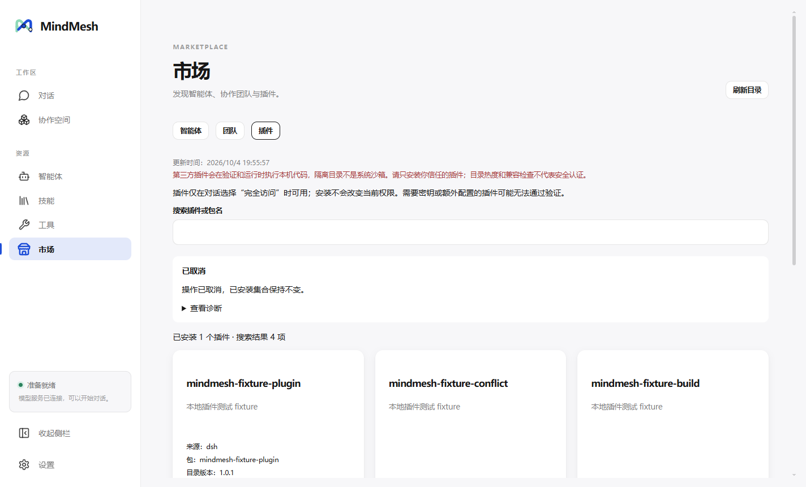

# PR 9：Plugin Catalog UI

日期：2026-10-04。基线：PR 8 `dc41a21`，已按用户要求 push 到 `origin/main`。PR 9 代码 `77f487c` 和后续展示/发布验收修复均已按用户要求 push。

## 目录与本机检查

Main 固定读取 [awesome-dsh-plugin 目录](https://awesome-dsh-plugin.com/plugins.json)，仅把它当作发现来源。真实 Electron 读取并规范化后得到 4,223 个条目。目录响应限制 16 MiB、10,000 项；只保留来源身份、说明、合法 npm 包名和 exact version，以及有界风险提示。远程 install 命令、任意下载 URL 和工具授权均不进入执行路径。缺少合法包名或版本的条目显示手动配置提示；即使上游元数据缺失，已安装插件的启停和移除仍然可用。

「本机检查」复用 PR 4 的完整 staging：exact 安装、required peer 依赖、完整配置与重复 entry、正式能力 patch、stdout framing、真实 SDK 初始化及 immutable artifact 封存。检查本身不写 desired state；对禁用目标的预检会临时启用目标进行验证，用户状态不变。只有当前 exact version 的兼容检查通过才开放安装/更新，提交前仍重新验证完整候选集合。

兼容缓存位于 `<dataDir>/marketplace-cache/plugin-compatibility.json`，身份包含 DSH 版本、Runtime schema、检查规则版本、平台/架构及插件集合 revision。缓存有大小/条目上限，运行环境或插件集合改变后旧结果不再作为当前兼容结果。联网失败保留 unknown，构建脚本需求显示 needs-approval，明确不兼容显示 incompatible；目录收录不代表安全审核。

## 操作与界面

固定 `plugins:state/change/cancel` IPC 和进度订阅只接受 Main 校验的操作、request ID、来源 key 和 exact version。Renderer 无法指定 registry、配置内容或 shell 参数。安装、更新、移除、启用、禁用均走现有串行 PluginManager，失败/取消保留旧集合，破坏 remaining required peers 的移除被拒绝。成功提交沿同一个 PluginSetManager 通知 Extended Runtime 失效，后续 Full Access 请求使用新的集合。

界面提供名称搜索、每批 60 个条目、目录/安装版本、已安装状态、配置是否为默认值、本机兼容结果、第三方风险提示、各实际阶段进度、取消和有界脱敏诊断。读取状态失败时禁用操作并允许重试；切页/重挂载恢复 Main 的当前操作。完整配置只留 Main，不把密钥或配置正文送到 Renderer。插件只在 Full Access 使用；此阶段没有配置编辑器、逐 Agent ACL 或 OS sandbox。

市场导航采用 `Store` 店铺图标，协作空间继续使用 `Boxes`，实际 Electron 冒烟检查两个 SVG 类不同。

## 数据与回滚

SQLite schema 仍为 PR 8 的 4，Runtime schema 仍为 2，无新增依赖或数据迁移。回滚前退出应用并保存完整 dataDir；PR 8 可以读取同一数据库和原有插件 desired state，新兼容缓存不参与旧版执行。不降低 schema 或删除 Runtime/插件 artifact。

## 可重复验证

- `tests/plugin-marketplace.test.ts` 使用真实 SQLite/PluginManager，覆盖目录边界、exact 版本、预检不提交、安装再验证、缓存失效、失败保持状态、请求注入、并发/取消/退出；仅昂贵 staging 使用测试 seam。
- `tests/plugin-marketplace-page.test.tsx` 覆盖检查门槛、更新、离线与上游缺少版本时的已安装操作、操作恢复、取消、诊断及订阅清理；Preload 测试验证固定 channels。
- `MINDMESH_E2E_RESTART=1 node scripts/electron-e2e-smoke.mjs --plugin-marketplace` 使用 loopback npm/catalog/model fixture，真正安装包并启动 DSH/SDK；PATH 仅含 Windows System32，无外部 pnpm。界面覆盖检查/安装/更新/启停/移除、peer 拒绝、安装脚本拒绝、重启状态及 Full Access 真实插件工具调用。只有开发者 CLI 的显式 fixture 文件可指定 loopback 测试地址。
- `node scripts/electron-e2e-smoke.mjs --plugin-catalog` 使用真实社区目录，验证规范化列表、Preload/CSP、图标和退出。
- Windows CI 增加 packaged 插件市场双轮 smoke，沿用已有 packaged 依赖和安全检查。

完整串行测试 31 个文件通过，296 项通过、3 项既有可选集成跳过；typecheck、format/lint 与 DSH 依赖检查通过（34 项直接依赖、533 个运行实例、required failures 0）。开发版双轮插件市场及真实社区目录 smoke 已通过。

最终 Windows unpacked/NSIS 构建通过，打包依赖检查覆盖 585 个运行实例、required failures 0。最终打包版双轮插件市场 smoke 通过，真实检查/安装/更新/启停/移除、required peer 拒绝、build approval 拒绝、Full Access 工具调用和重启后的真实取消均通过；另跑 packaged sandbox/CSP 安全 smoke 通过。

NSIS 静默安装到短路径隔离目录 `C:\Temp\mm-pr9-105b` 成功；安装版同样完成上述全部插件流程和双轮重启，实际 Full Access 工具调用、取消保护、sandbox/CSP 均通过。随后静默卸载成功，主程序已移除，未发现该安装目录或本轮隔离用户目录的残留进程。

Standards/Spec 双路审查已完成：发现并修复「上游缺少合法版本隐藏已安装控制」问题，回归测试和增量复审通过。剩余代码问题 0。后续按用户选择使用 GitHub Actions 全新 Windows VM 完成发布 Gate：[37208483147](https://github.com/Even-wang666/MindMesh/actions/runs/37208483147) 的完整检查、打包和独立安装 job 全部成功，安装版三类市场双轮、插件真实工具调用、core 物理隔离及卸载通过。见 [展示补齐与独立 Windows 验收](marketplace-release-completion-2026-10.md)。
